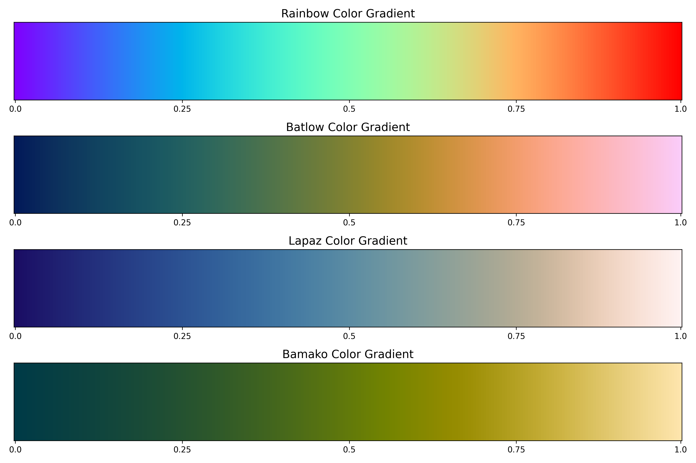
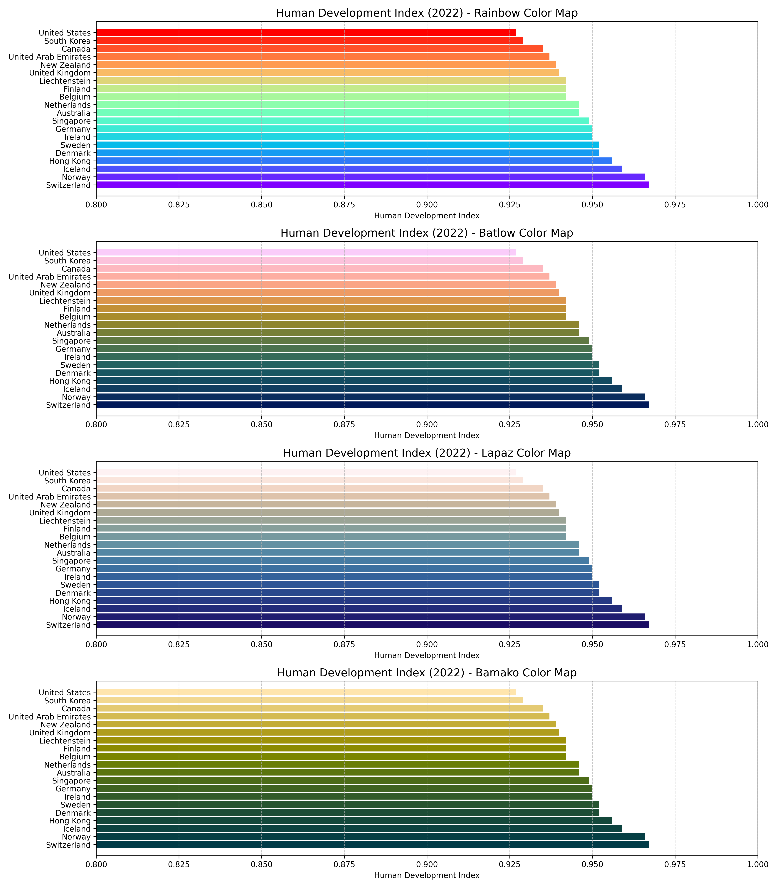
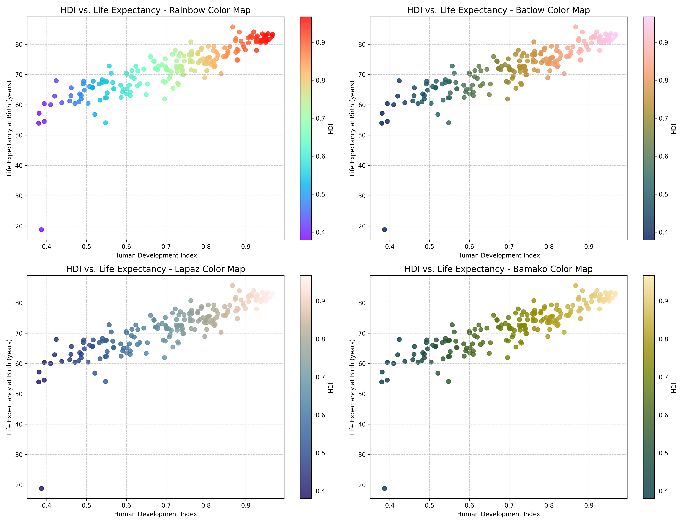
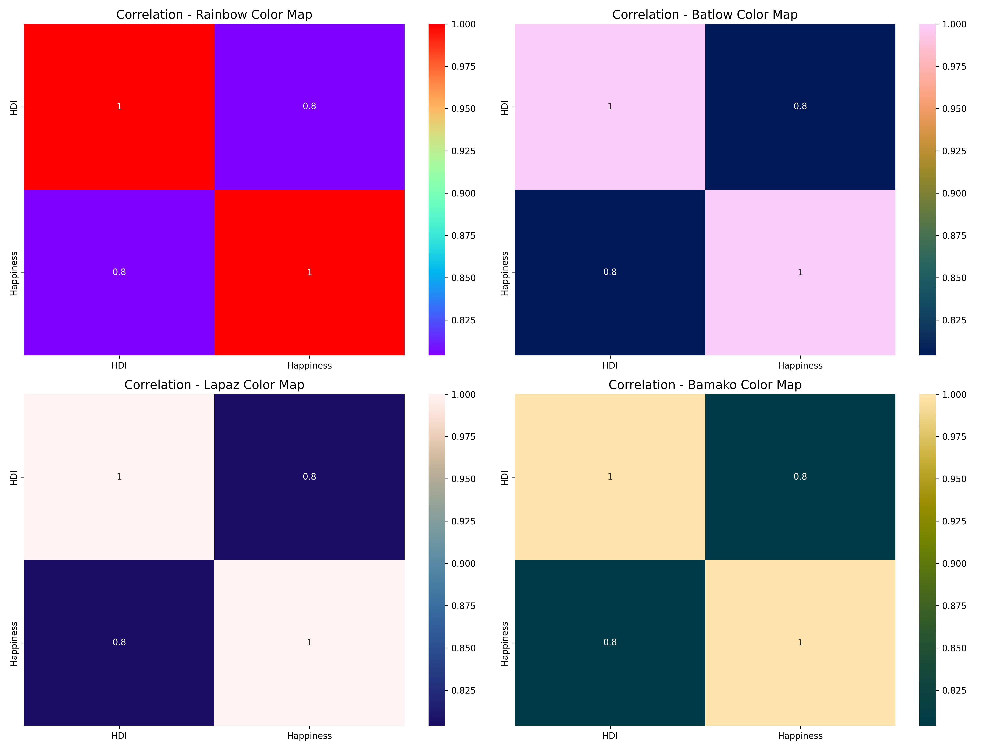
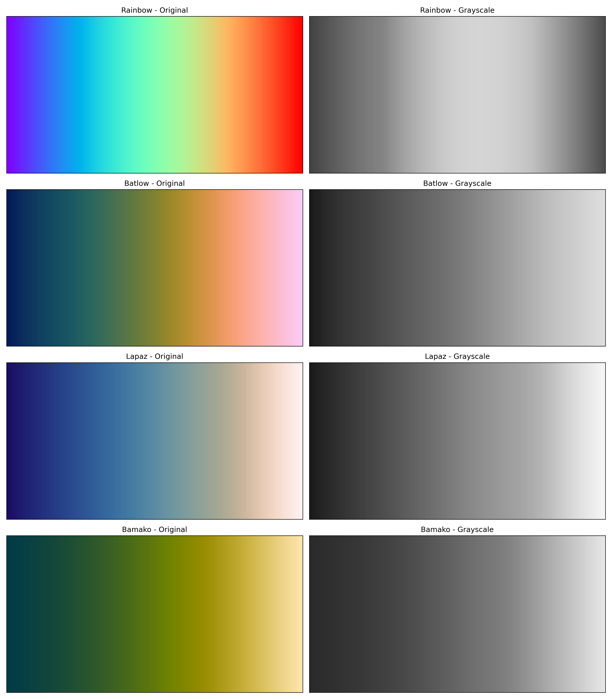

# Comparando Mapas de Cores para Visualização Científica

Este repositório contém um projeto de análise e visualização que compara o tradicional mapa de cores "rainbow" com três mapas de cores cientificamente derivados: **batlow**, **lapaz** e **bamako**.



## 📋 Sobre o Projeto

Este trabalho foi desenvolvido como parte de uma atividade acadêmica sobre visualização de dados científicos. O objetivo principal é demonstrar como a escolha de mapas de cores impacta diretamente a interpretação e compreensão dos dados, podendo levar a conclusões equivocadas quando feita de maneira inadequada.

Um relatório completo com análises detalhadas está disponível no arquivo [Comparando_Mapas_de_Cores_para_Visualização_Científica__ou_Não_.pdf](Comparando_Mapas_de_Cores_para_Visualização_Científica__ou_Não_.pdf) neste repositório.

## 🎯 Principais Objetivos

- Analisar como diferentes mapas de cores afetam a interpretação dos dados
- Demonstrar os problemas do mapa rainbow em contextos científicos
- Apresentar alternativas cientificamente derivadas que melhoram a percepção e interpretação dos dados
- Discutir aspectos de acessibilidade na escolha de mapas de cores

## 🧪 Fundamentação Teórica

Este trabalho se baseia em conceitos apresentados nos artigos:
- "Using Colour to Communicate" de Ed Hawkins
- "The misuse of colour in science communication" (Crameri, F., Shephard, G.E. & Heron, P.J. Nature Communications 11, 5444, 2020)

## 📊 Conjuntos de Dados

Para esta análise, utilizamos três conjuntos de dados relacionados ao desenvolvimento humano global:

- `human-development-index.csv`: Índice de Desenvolvimento Humano (IDH) global
- `happiness-cantril-ladder.csv`: Índice de felicidade (Cantril ladder score)
- `life-expectancy.csv`: Expectativa de vida global

Todos os dados foram obtidos do repositório [Our World in Data](https://ourworldindata.org/).

## 🎨 Mapas de Cores Analisados

1. **Rainbow**: Tradicionalmente usado em visualizações científicas, apresenta transições por todo o espectro de cores do arco-íris, do violeta ao vermelho.

2. **Batlow**: Mapa científico que vai do azul escuro ao amarelo/laranja, com transições suaves e perceptualmente uniformes.

3. **Lapaz**: Mapa científico com transição do azul para o branco/amarelo, projetado para ser perceptualmente uniforme.

4. **Bamako**: Mapa científico com transição do azul para o magenta e amarelo, oferecendo uma alternativa estética distinta.

## 📊 Visualizações Geradas

O script gera cinco tipos de visualizações comparativas:

### 1. Comparação de Gradientes


Demonstra como cada mapa de cores representa um gradiente contínuo de valores.

### 2. Gráficos de Barras


Mostra o IDH dos 20 países com maior desenvolvimento usando cada mapa de cores.

### 3. Gráficos de Dispersão


Relaciona IDH e expectativa de vida com cada mapa de cores.

### 4. Mapas de Calor


Visualiza correlações usando cada mapa de cores.

### 5. Simulação em Escala de Cinza


Demonstra como cada mapa de cores é percebido quando convertido para escala de cinza, simulando a percepção de pessoas com deficiência na percepção de cores.

## 💻 Como Executar o Código

### Pré-requisitos

- Python 3.6 ou superior
- Bibliotecas Python: pandas, matplotlib, numpy, seaborn, cmocean, colorcet, cmcrameri

### Instalação das Dependências

```bash
pip install pandas matplotlib numpy seaborn cmocean colorcet cmcrameri
```

### Execução

```bash
python color_map_extended.py
```

Este comando irá:
1. Carregar os conjuntos de dados
2. Gerar as cinco visualizações comparativas
3. Salvar as visualizações no diretório `outputs/`
4. Criar um arquivo de análise textual `expanded_color_map_analysis.txt`

## 📝 Conclusões Principais

A análise comparativa demonstrou claramente que:

1. **Problemas do mapa Rainbow**:
   - Distorções na percepção de variações de dados
   - Criação de fronteiras artificiais em dados contínuos
   - Ordenação não intuitiva
   - Sérios problemas de acessibilidade (especialmente em escala de cinza)

2. **Vantagens dos mapas científicos**:
   - Uniformidade perceptual
   - Melhor acessibilidade para pessoas com deficiência na percepção de cores
   - Ordem intuitiva através de gradientes de luminosidade consistentes
   - Representação mais fiel dos dados sem criar padrões artificiais

Para detalhes completos da análise, consulte o [relatório em PDF](Comparando_Mapas_de_Cores_para_Visualização_Científica__ou_Não_.pdf).

## 🔗 Referências

1. Crameri, F., Shephard, G.E. & Heron, P.J. The misuse of colour in science communication. Nat Commun 11, 5444 (2020). https://doi.org/10.1038/s41467-020-19160-7

2. Hawkins, E. "Using Colour to Communicate" https://www.climate-lab-book.ac.uk/2016/why-rainbow-colour-scales-can-be-misleading/

3. Our World in Data. Human Development Index (https://ourworldindata.org/grapher/human-development-index)

4. Our World in Data. Life expectancy at birth (https://ourworldindata.org/grapher/life-expectancy)

5. Our World in Data. Self-reported life satisfaction (https://ourworldindata.org/grapher/happiness-cantril-ladder)

## 📄 Licença

Este projeto é disponibilizado sob a licença MIT.
